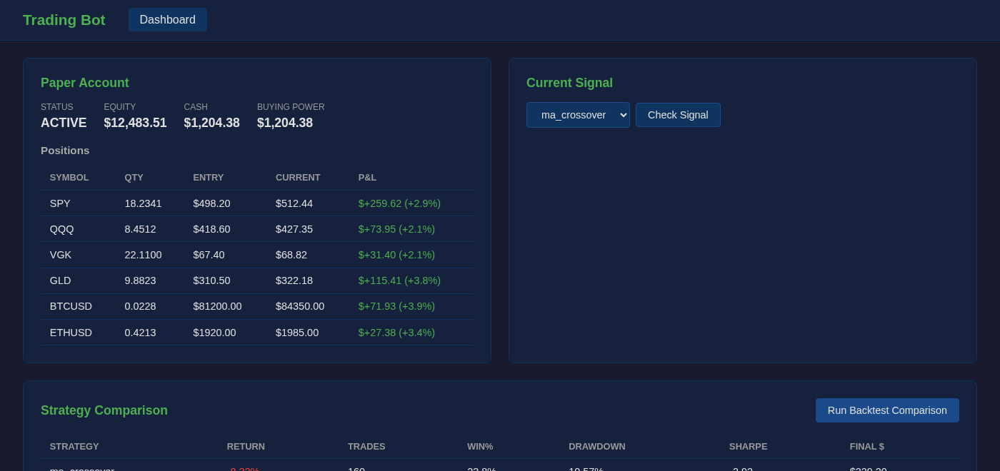

# Trading Bot

[](https://github.com/EliasAbouKhater/trading-bot/actions/workflows/ci.yml)
[](LICENSE)
[](https://www.python.org/downloads/)
[](https://alpaca.markets)

A **regime-aware portfolio rebalancing bot** with backtesting, paper trading, and a live dashboard. Connects to [Alpaca](https://alpaca.markets) for order execution across stocks, ETFs, and crypto.



---

> **Disclaimer:** This software is for educational and research purposes only. It does not constitute financial advice. Trading involves substantial risk of loss. Past performance is not indicative of future results. Use at your own risk.

---

## Philosophy — Long-Term Investing, Not Day Trading

This bot is not a day trader. It makes a handful of decisions per year. Its benchmark is **buy and hold** — and it's designed to beat it: capturing more gains when markets rise, and losing less when they fall.

The core idea is **buy and hold with disciplined rebalancing**: when one asset grows beyond its target weight, the bot trims it and buys what fell behind — systematically selling high and buying low without predicting anything. Add regime detection (bull vs bear via SPY's 200-day SMA) and monthly DCA, and you get a system that adapts to market conditions while staying fully hands-off.

**→ [Full investment philosophy and glossary](docs/PHILOSOPHY.md)**

---

## Features

- **Bull/Bear regime detection** via SPY 200-day SMA — adapts rebalancing frequency and drift thresholds to market conditions
- **Volatility-adjusted drift thresholds** — per-asset, computed from 1-year historical volatility, tighter in bear markets
- **Monthly DCA** — distributes a fixed injection proportionally across all target assets
- **Pluggable strategies** — MA crossover, grid trading, pairs mean-reversion (for paper/backtest mode)
- **Backtesting engine** — test any strategy on historical data with detailed metrics
- **Live dashboard** — Flask web UI showing portfolio state, positions, and regime
- **Multi-asset** — stocks, ETFs, and crypto in a single portfolio via Alpaca

---

## How It Works

### 1. Macro Regime Detection

On every run, SPY is fetched and its 200-day SMA is computed:

| Regime | Condition | Effect |
|--------|-----------|--------|
| **BULL** | SPY > SMA-200 | Rebalance every ~126 trading days, wider drift tolerance |
| **BEAR** | SPY < SMA-200 | Rebalance every ~21 trading days, tighter drift tolerance |

### 2. Rebalancing Triggers

A rebalance fires when **either** condition is met:

| Trigger | Description |
|---------|-------------|
| **Time** | Scheduled interval elapsed (regime-dependent) |
| **Drift** | Any asset deviates from its target weight beyond its volatility-adjusted threshold |

Drift threshold per asset:
```
threshold = vol_multiplier × annualized_volatility(1y)
           clamped to [min_pct, max_pct]
           × regime_factor  (1.5× in BULL, 0.7× in BEAR)
```

### 3. Target Allocations

Fully configurable in `config.yaml`. Example:

```yaml
allocations:
  SPY: 0.30    # 30% — S&P 500 (broad US market)
  QQQ: 0.10    # 10% — Nasdaq 100 (tech-heavy)
  VGK: 0.10    # 10% — FTSE Europe (international)
  GLD: 0.25    # 25% — Gold ETF (inflation hedge)
  BTC/USD: 0.15  # 15% — Bitcoin
  ETH/USD: 0.10  # 10% — Ethereum
```

### 4. Order Execution

- Sells execute first to free up cash, then buys
- Alpaca fractional shares for stocks/ETFs; native crypto pairs for digital assets
- Trades under $1 (dust) are skipped automatically

---

## Requirements

- Python 3.10+
- [Alpaca Markets](https://alpaca.markets) account (paper or live)
- Internet connection for market data (via `yfinance`)

---

## Installation

```bash
git clone https://github.com/EliasAbouKhater/trading-bot.git
cd trading-bot
pip install -r requirements.txt
```

### Configure

```bash
cp .env.example .env
# Fill in your Alpaca API credentials
```

Edit `config.yaml` to set your target allocations, capital, and DCA amount.

---

## Usage

```bash
# Compare all strategies on historical data
python3 run.py backtest --compare

# Backtest a single strategy
python3 run.py backtest --strategy ma_crossover

# Check paper account balance and positions
python3 run.py account

# Run a live paper trading signal check
python3 run.py paper --strategy ma_crossover

# Launch the dashboard (http://localhost:5050)
python3 app.py
```

### Automated Rebalancing

Run `cron_rebalance.py` on a schedule:

```bash
# Manual run
python3 cron_rebalance.py

# Daily cron at 9 AM (weekdays)
0 9 * * 1-5 /path/to/venv/bin/python3 /path/to/trading-bot/cron_rebalance.py
```

Optional: set `TELEGRAM_BOT_TOKEN` and `TELEGRAM_ADMIN_ID` in `.env` for notifications. Skip events are batched into a summary every 3 days. Actual rebalances and errors always notify immediately.

---

## Strategies

| Strategy | Description | Best For |
|----------|-------------|----------|
| `ma_crossover` | Golden/death cross on short vs long SMA | Trending markets |
| `grid` | Buy/sell at fixed price levels within a range | Sideways/ranging markets |
| `pairs` | Mean-reversion on the spread between two correlated assets | Pairs with stable correlation |

### Adding a Strategy

1. Create `strategies/my_strategy.py` inheriting `Strategy` from `strategies/base.py`
2. Implement `generate_signals(df) -> df` — adds a `signal` column (`1` = buy, `-1` = sell, `0` = hold)
3. Register it in `strategies/__init__.py`
4. Add a config block under `strategies:` in `config.yaml`

---

## Risk Management

All parameters configurable under `risk:` in `config.yaml`:

| Parameter | Default | Description |
|-----------|---------|-------------|
| `max_risk_per_trade_pct` | 20% | Max portfolio % allocated per trade |
| `stop_loss_pct` | 8% | Stop-loss trigger |
| `take_profit_pct` | 12% | Take-profit trigger |
| `max_drawdown_pct` | 30% | Portfolio-level kill switch |
| `max_open_positions` | 5 | Max simultaneous open positions |

---

## Project Structure

```
trading-bot/
├── core/
│   ├── broker.py          # Alpaca API wrapper
│   ├── engine.py          # Backtesting engine
│   ├── live_rebalance.py  # Live rebalancing logic + regime detection
│   ├── risk.py            # Risk management
│   └── data.py            # Market data fetching & caching
├── strategies/
│   ├── base.py            # Strategy base class
│   ├── ma_crossover.py    # Moving average crossover
│   ├── grid.py            # Grid trading
│   └── pairs.py           # Pairs mean-reversion
├── dashboard/             # Flask web UI
├── data/                  # Cached market data (gitignored)
├── logs/                  # Run logs (gitignored)
├── config.yaml            # All tunable parameters
├── .env.example           # API key template
├── run.py                 # CLI entry point
├── app.py                 # Dashboard entry point
└── cron_rebalance.py      # Scheduled rebalancing runner
```

---

## Stack

- **Broker**: [Alpaca Markets](https://alpaca.markets) (paper + live, stocks/ETFs/crypto)
- **Market data**: [yfinance](https://github.com/ranaroussi/yfinance)
- **Analysis**: pandas, numpy, [ta](https://github.com/bukosabino/ta)
- **Dashboard**: Flask
- **Notifications**: Telegram Bot API (optional)

---

## License

[MIT](LICENSE)
